

# AI聊天存档大师  
# AI Chat Archiver

让重要的 AI 对话不再丢失，支持归档、整理、回看与可视化展示。  
Archive, organize, revisit, and visualize your valuable AI conversations.

  
  
  
  
  

  <a href="#中文">中文</a> ·
  <a href="#english">English</a>

---

## 项目预览 / Preview

  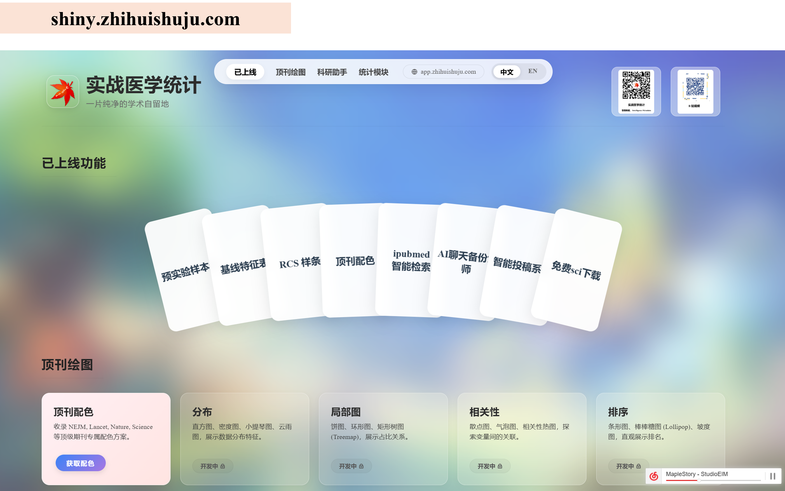
  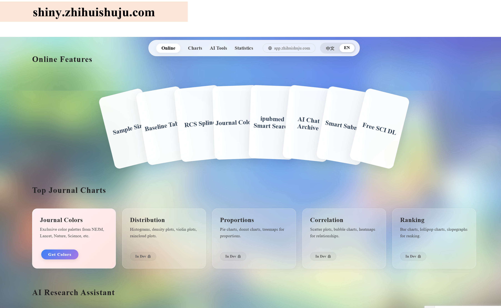

---

## 中文

### 项目简介

**智荟 AI 聊天档案馆** 是一个面向 AI 聊天场景的 Chrome 扩展。  
它帮助你把有价值的聊天内容沉淀下来，进行归档、整理、浏览和二次利用，让碎片化的 AI 对话真正成为可检索、可复用的知识资产。

### 核心亮点

- 📦 一键归档重要 AI 聊天内容
- 🗂 更清晰的界面管理与内容浏览
- 🔍 更方便的历史回看与整理
- 🧠 支持思维导图式内容理解与展示
- 🌏 提供中英文双语展示素材，更适合公开项目主页

### 界面展示

<table>
  <tr>
    <td align="center" width="50%">
      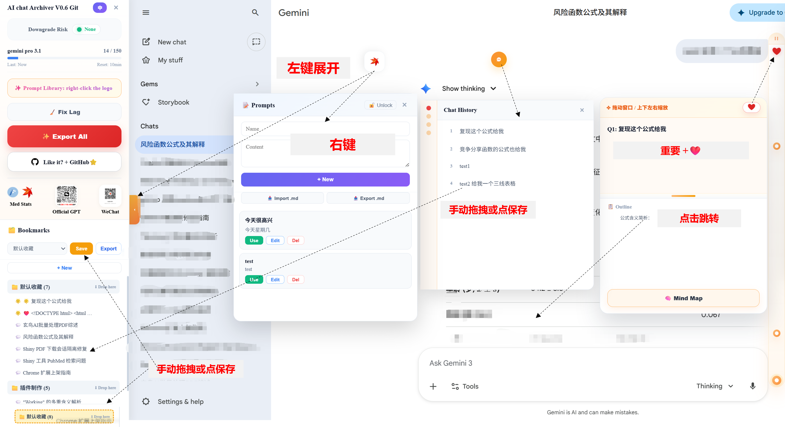
       
      <b>主界面</b>：清晰展示归档内容与操作入口
    </td>
    <td align="center" width="50%">
      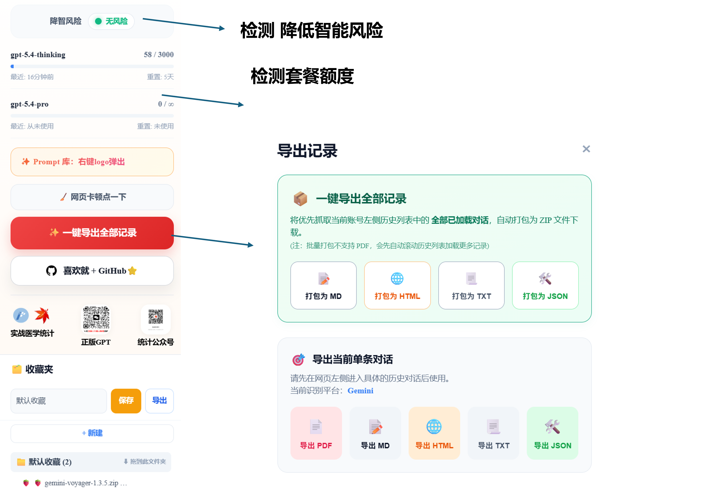
       
      <b>功能视图</b>：更直观地查看归档内容与结构
    </td>
  </tr>
</table>

<table>
  <tr>
    <td align="center" width="50%">
      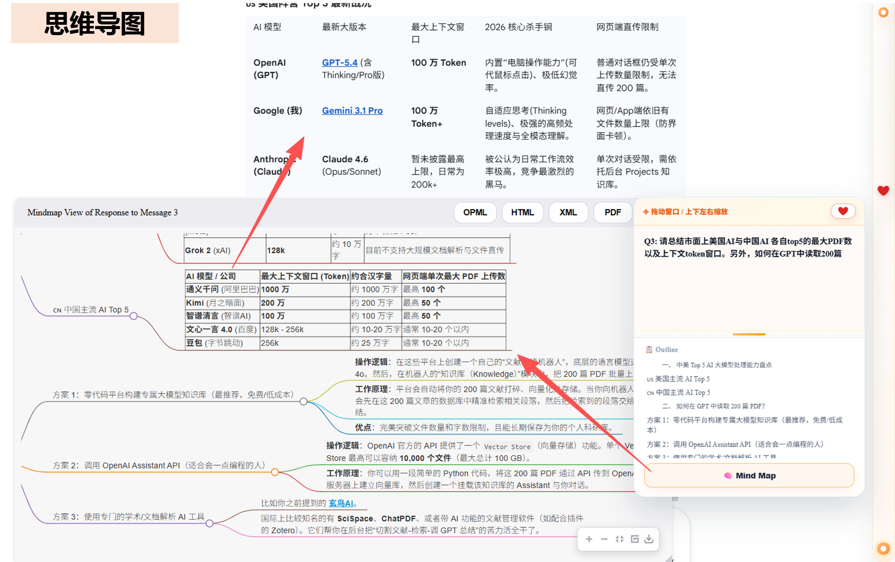
       
      <b>思维导图</b>：帮助你从聊天内容中快速提炼结构
    </td>
    <td align="center" width="50%">
      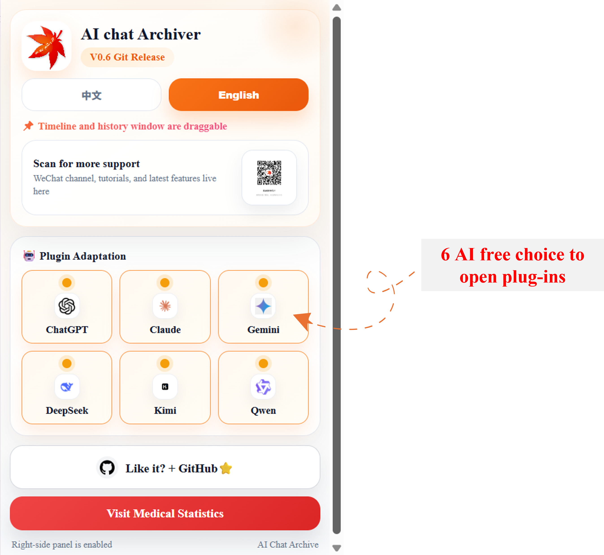
       
      <b>插件入口</b>：轻量、直接、开箱即用
    </td>
  </tr>
</table>

### 细节预览

  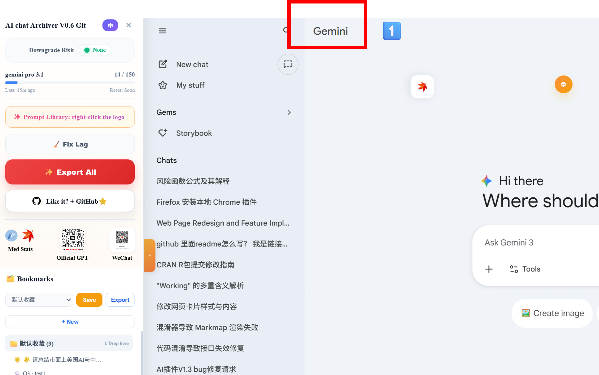
  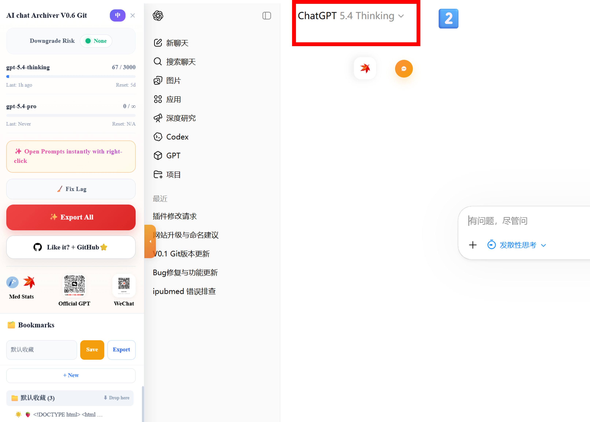
  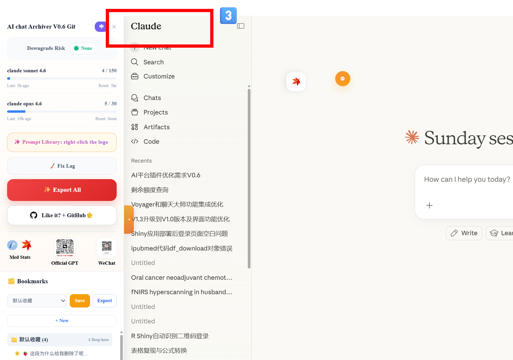
  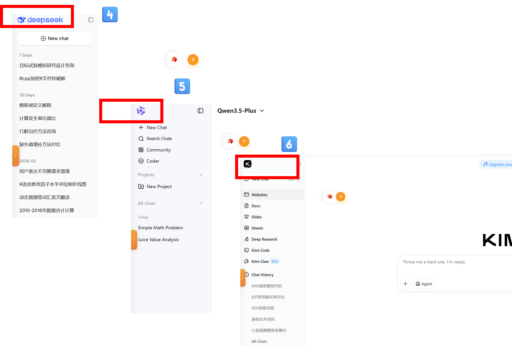

### 使用场景

- 保存高价值 AI 对话，避免后续难以回溯
- 把零散的聊天内容沉淀为知识资料
- 用更直观的方式复盘复杂讨论
- 将 AI 交流结果用于学习、研究、写作或项目整理

### 安装方式

1. 点击本仓库右上角 **Code**，下载 ZIP，或者使用 `git clone` 克隆到本地。
2. 打开 Chrome 浏览器，进入 `chrome://extensions/`
3. 打开右上角 **开发者模式**
4. 点击左上角 **加载已解压的扩展程序**
5. 选择项目目录，完成安装

### 推荐的 README 展示顺序

如果你后面继续优化项目主页，建议按这个顺序展示：

1. 顶部标题与一句话价值主张  
2. 徽章区（stars / license / platform）  
3. 首页大图预览  
4. 核心亮点  
5. 中文截图展示  
6. 英文截图展示  
7. 安装说明  
8. License

---

## English

### Overview

**AI Chat Archiver** is a Chrome extension designed for AI conversation archiving.  
It helps you preserve valuable chats, organize them efficiently, revisit them later, and transform scattered AI conversations into reusable knowledge assets.

### Highlights

- 📦 Archive important AI conversations with ease
- 🗂 Organize and browse content more clearly
- 🔍 Revisit and manage historical chats efficiently
- 🧠 Visualize content through mind-map style views
- 🌏 Bilingual assets for a cleaner open-source project homepage

### Interface Showcase

<table>
  <tr>
    <td align="center" width="50%">
      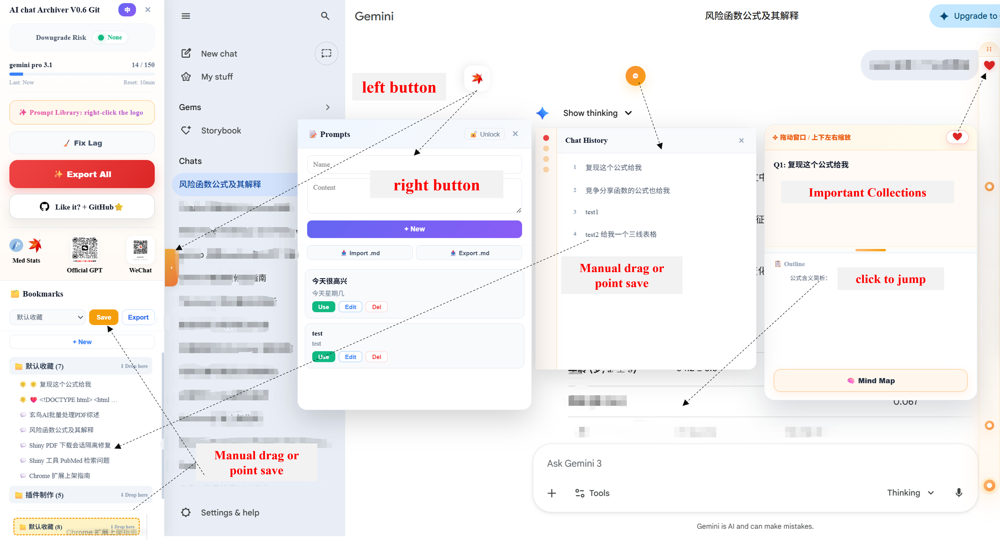
       
      <b>Main Interface</b>: browse archived conversations with a clean layout
    </td>
    <td align="center" width="50%">
      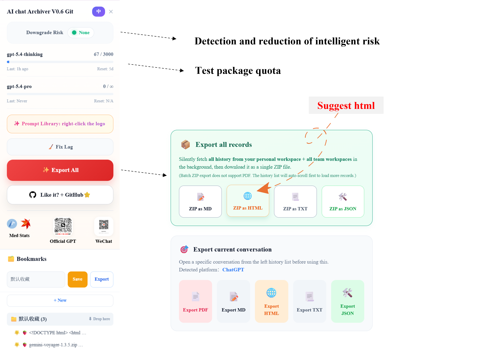
       
      <b>Feature View</b>: clearer structure and faster navigation
    </td>
  </tr>
</table>

<table>
  <tr>
    <td align="center" width="50%">
      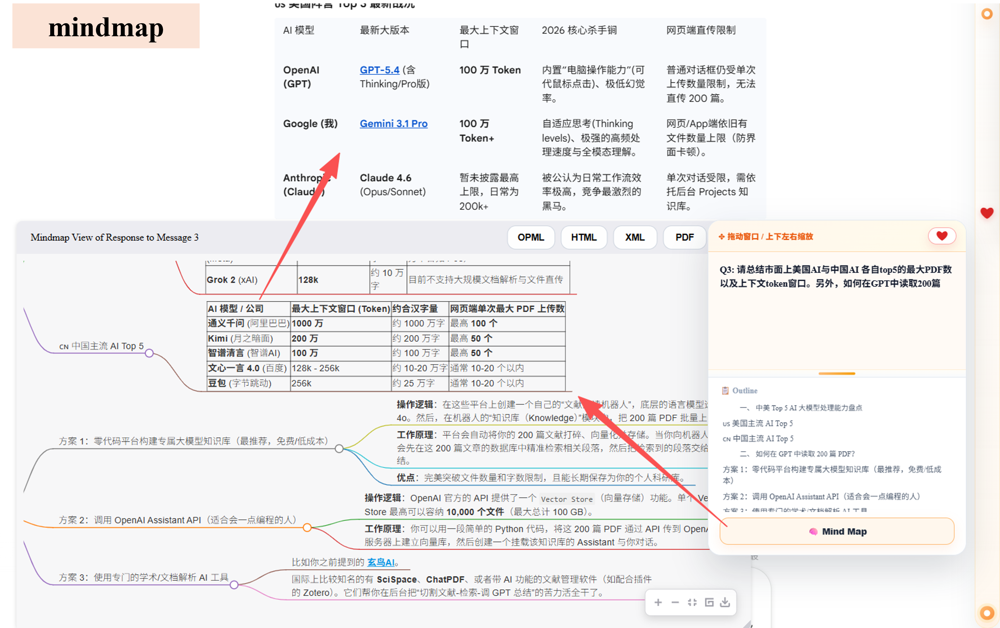
       
      <b>Mind Map View</b>: understand and review conversations visually
    </td>
    <td align="center" width="50%">
      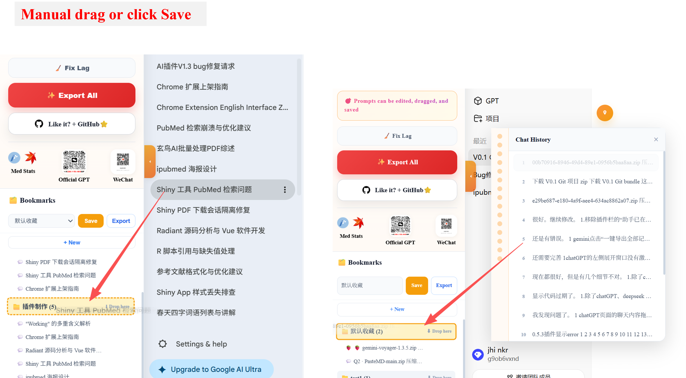
       
      <b>Extended View</b>: support deeper browsing and content exploration
    </td>
  </tr>
</table>

### Detail Preview

  
  
  
  

### Use Cases

- Preserve valuable AI chats for future reference
- Turn fragmented conversations into reusable knowledge
- Review complex discussions in a more visual way
- Reuse archived AI outputs for study, research, writing, or project work

### Installation

1. Download this repository as a ZIP file, or clone it with `git clone`
2. Open Chrome and go to `chrome://extensions/`
3. Enable **Developer mode**
4. Click **Load unpacked**
5. Select this project folder

---

## Roadmap

- [ ] Improve homepage storytelling
- [ ] Add more polished product screenshots
- [ ] Add release/version management
- [ ] Add usage demo GIF
- [ ] Publish extension store link

---

## License

This project is licensed under the MIT License.
